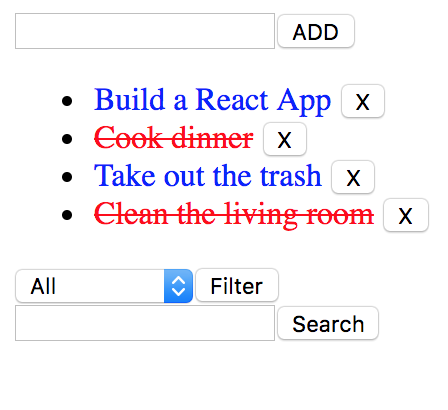

# A simple React To-Do List



## How to install
1. In your terminal, clone the repo
```
git clone git@github.com:bnguyen212/react-todo.git
```
2. Install 
   - **Note**: you need to have a mongoDB database and create an env.sh file in the main directory before this step
```
source env.sh
npm install
npm start
```
3. Your To-Do List can be accessed in the following directory ```localhost:3000```
